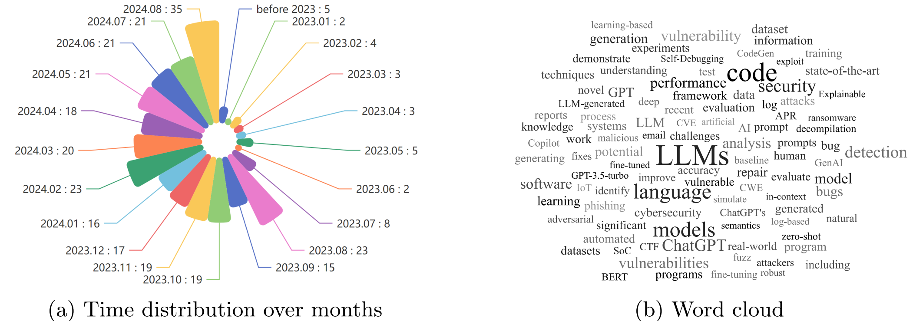

## 当大型语言模型遇上网络安全：一项系统性文献综述


[](https://arxiv.org/abs/2405.03644)


## 🔥 更新日志
📆【2025-03-03】已更新至 **2025.02.28**，新增 *33* 篇论文（2025.01.01–2025.02.28）。

📆【2025-01-21】已更新至 **2024.12.31**，新增 *74* 篇论文（2024.09.01–2024.12.31）。

📆【2025-01-08】已补充**每篇论文的发表场所信息**。

📆【2024-09-21】已更新至 **2024.08.31**，新增 *75* 篇论文（2024.06.01–2024.08.31）。

<!-- TOC -->

- [当大型语言模型遇上网络安全：一项系统性文献综述](#当大型语言模型遇上网络安全一项系统性文献综述)
- [🔥 更新日志](#-更新日志)
- [🌈 引言](#-引言)
- [🚩 研究特性](#-研究特性)
- [🌟 文献汇总](#-文献汇总)
  - [RQ1：如何构建面向网络安全领域的大型语言模型？](#rq1如何构建面向网络安全领域的大型语言模型)
    - [网络安全评测基准](#网络安全评测基准)
    - [网络安全领域微调大模型](#网络安全领域微调大模型)
  - [RQ2：大型语言模型在网络安全中的潜在应用](#rq2大型语言模型在网络安全中的潜在应用)
    - [威胁情报](#威胁情报)
    - [模糊测试（FUZZ）](#模糊测试fuzz)
    - [漏洞检测](#漏洞检测)
    - [不安全代码生成](#不安全代码生成)
    - [程序修复](#程序修复)
    - [异常检测](#异常检测)
    - [大模型辅助攻击](#大模型辅助攻击)
    - [其他应用](#其他应用)
  - [RQ3：关于大型语言模型在网络安全中的应用，还有哪些进一步的研究方向？](#rq3关于大型语言模型在网络安全中的应用还有哪些进一步的研究方向)
    - [进一步研究：Agent4Cybersecurity（网络安全智能体）](#进一步研究agent4cybersecurity网络安全智能体)
- [📖BibTeX](#bibtex)

<!-- /TOC -->
## 🌈 引言
我们很高兴地呈现《当大型语言模型遇上网络安全：一项系统性文献综述》，这是一份关于大型语言模型（LLM）在网络安全领域应用的全面概览。

本综述旨在回答三个关键问题：
- RQ1：如何构建面向网络安全领域的大型语言模型？
- RQ2：大型语言模型在网络安全中的潜在应用有哪些？
- RQ3：大型语言模型在网络安全中的应用存在哪些挑战与未来研究方向？


## 🚩 研究特性

（2024.08.20）我们的研究涵盖了 300 多篇相关工作，涉及 25+ 个大型语言模型以及 10 多个下游应用场景。




## 🌟 文献汇总

### RQ1：如何构建面向网络安全领域的大型语言模型？

#### 网络安全评测基准

1. Primus：面向网络安全大模型训练的开源数据集先驱合集 ｜ *arXiv* ｜ 2025.02.16 ｜ [<u>论文链接</u>](https://arxiv.org/pdf/2502.11191)

2. ITBench：跨多样真实世界 IT 自动化任务评估 AI 代理 ｜ *arXiv* ｜ 2025.02.07 ｜ [<u>论文链接</u>](https://arxiv.org/pdf/2502.05352)

3. SecBench：用于网络安全大模型的综合多维度基准数据集 ｜ *arXiv* ｜ 2024.12.31 ｜ [<u>论文链接</u>](https://arxiv.org/pdf/2412.20787)

4. AI 网络风险基准：自动化利用能力评估 ｜ *arXiv* ｜ 2024.12.09 ｜ [<u>论文链接</u>](https://arxiv.org/pdf/2410.21939)

5. CS-Eval：面向网络安全的大型语言模型综合基准 ｜ *arXiv* ｜ 2024.11.25 ｜ [<u>论文链接</u>](https://arxiv.org/pdf/2411.16239)

6. AttackER：通过命名实体识别数据集提升网络攻击溯源能力 ｜ *arXiv* ｜ 2024.08.09 ｜ [<u>论文链接</u>](https://arxiv.org/pdf/2408.05149)

7. CYBERSECEVAL 3：推进大模型网络安全风险与能力评估 ｜ *arXiv* ｜ 2024.08.03 ｜ [<u>论文链接</u>](https://arxiv.org/pdf/2408.01605)

8. eyeballvul：面向现实漏洞检测的未来型基准 ｜ *arXiv* ｜ 2024.07.11 ｜ [<u>论文链接</u>](https://arxiv.org/pdf/2407.08708)

9. NYU CTF 数据集：用于评估大模型进攻安全能力的可扩展开源基准 ｜ *arXiv* ｜ 2024.06.09 ｜ [<u>论文链接</u>](https://arxiv.org/pdf/2406.05590)

10. SECURE：面向网络安全咨询的大模型基准评测 ｜ *arXiv* ｜ 2024.05.30 ｜ [<u>论文链接</u>](https://arxiv.org/pdf/2405.20441)

11. 评估代码大模型中的网络安全漏洞 ｜ *arXiv* ｜ 2024.04.29 ｜ [<u>论文链接</u>](https://arxiv.org/pdf/2404.18567)

12. 大模型能理解计算机网络吗？迈向虚拟系统管理员 ｜ *arXiv* ｜ 2024.04.22 ｜ [<u>论文链接</u>](https://arxiv.org/pdf/2404.12689)

13. LLMSecEval：面向安全评估的自然语言提示数据集 ｜ *IEEE/ACM 国际软件仓库挖掘大会* ｜ 2023.03.16 ｜ [<u>论文链接</u>](https://arxiv.org/abs/2303.09384)

14. OpsEval：面向大模型的 IT 运维综合基准套件 ｜ *arXiv* ｜ 2024.02.16 ｜ [<u>论文链接</u>](https://arxiv.org/abs/2310.07637)

15. 大模型能修补安全问题吗？ ｜ *arXiv* ｜ 2024.02.19 ｜ [<u>论文链接</u>](https://arxiv.org/abs/2312.00024)

16. CyberMetric：评估大模型网络安全知识的基准数据集 ｜ *arXiv* ｜ 2024.02.12 ｜ [<u>论文链接</u>](https://arxiv.org/abs/2402.07688)

17. DebugBench：评估大模型调试能力的基准 ｜ *ACL Findings* ｜ 2024.01.11 ｜ [<u>论文链接</u>](https://arxiv.org/abs/2401.04621)

18. Securityeval 数据集：挖掘漏洞示例以评估基于机器学习的代码生成技术 ｜ *隐私与安全软件仓库应用国际研讨会* ｜ 2022.11.09 ｜ [<u>论文链接</u>](https://dl.acm.org/doi/10.1145/3549035.3561184)

19. SecQA：评估大模型网络安全能力的简明问答数据集 ｜ *arXiv* ｜ 2023.12.26 ｜ [<u>论文链接</u>](https://arxiv.org/abs/2312.15838v1)

20. Purple Llama CyberSecEval：面向安全编码的大模型基准 ｜ *arXiv* ｜ 2023.12.07 ｜ [<u>论文链接</u>](https://arxiv.org/abs/2312.04724)

21. 预训练大模型网络运维能力实证研究 ｜ *arXiv* ｜ 2023.09.19 ｜ [<u>论文链接</u>](https://arxiv.org/abs/2309.05557)

22. SecEval：评估基础模型网络安全知识的综合基准 ｜ *Github* ｜ 2023 ｜ [<u>论文链接</u>](https://xuanwuai.github.io/SecEval/)


#### 网络安全领域微调大模型

1. ELTEX：一个面向领域驱动的合成数据生成框架 ｜ *arXiv* ｜ 2025.03.19 ｜ [<u>论文链接</u>](https://arxiv.org/abs/2503.15055)

2. 微调大模型以检测 DGA 和 DNS 数据泄露 ｜ *arXiv* ｜ 2024.11.07 ｜ [<u>论文链接</u>](https://arxiv.org/pdf/2410.21723)

3. AttackQA：基于微调开源大模型支持网络安全运维的数据集开发与应用 ｜ *arXiv* ｜ 2024.11.02 ｜ [<u>论文链接</u>](https://arxiv.org/pdf/2411.01073)

4. Hackphyr：面向网络安全环境的本地微调大模型代理 ｜ *arXiv* ｜ 2024.09.17 ｜ [<u>论文链接</u>](https://arxiv.org/pdf/2409.11276)

5. CyberPal.AI：为大模型注入专家驱动网络安全指令 ｜ *arXiv* ｜ 2024.08.18 ｜ [<u>论文链接</u>](https://arxiv.org/pdf/2408.09304)

6. IoT-LM：面向物联网的大型多模态语言模型 ｜ *arXiv* ｜ 2024.07.13 ｜ [<u>论文链接</u>](https://arxiv.org/pdf/2407.09801)

7. 参数高效微调在自动化程序修复中的综合评估 ｜ *arXiv* ｜ 2024.06.09 ｜ [<u>论文链接</u>](https://arxiv.org/pdf/2406.05639)

8. 通过多任务自指令微调提升大模型漏洞检测能力 ｜ *arXiv* ｜ 2024.06.09 ｜ [<u>论文链接</u>](https://arxiv.org/pdf/2406.05892)

9. 通过探索大模型微调重塑网络安全与公众信任 ｜ *arXiv* ｜ 2024.06.02 ｜ [<u>论文链接</u>](https://arxiv.org/pdf/2406.00628)

10. 评估大模型在真实恶意软件去混淆中的能力 ｜ *arXiv* ｜ 2024.04.30 ｜ [<u>论文链接</u>](https://arxiv.org/pdf/2404.19715)

11. Nova+：面向二进制文件的生成式语言模型 ｜ *arXiv* ｜ 2023.11.27 ｜ [<u>论文链接</u>](https://arxiv.org/abs/2311.13721)

12. 面向安全代码生成的指令微调 ｜ *ICML* ｜ 2024.02.14 ｜ [<u>论文链接</u>](https://arxiv.org/abs/2402.09497)

13. 使用漏洞约束解码避免自动补全智能合约代码中的漏洞 ｜ *ISSRE* ｜ 2023.10.06 ｜ [<u>论文链接</u>](https://arxiv.org/abs/2309.09826)

14. RepairLLaMA：高效表示与微调适配器的程序修复模型 ｜ *arXiv* ｜ 2024.03.11 ｜ [<u>论文链接</u>](https://arxiv.org/abs/2312.15698)

15. 微调大模型用于漏洞检测 ｜ *arXiv* ｜ 2024.02.29 ｜ [<u>论文链接</u>](https://arxiv.org/abs/2401.17010)

16. 面向免测试故障定位的大模型 ｜ *ICSE* ｜ 2023.10.03 ｜ [<u>论文链接</u>](https://arxiv.org/abs/2310.01726)

17. HackMentor：微调大模型以支持网络安全 ｜ *TrustCom* ｜ 2023.09 ｜ [<u>论文链接</u>](https://github.com/tmylla/HackMentor)

18. Owl：面向 IT 运维的大型语言模型 ｜ *ICLR* ｜ 2023.09.17 ｜ [<u>论文链接</u>](https://arxiv.org/abs/2309.09298)

19. SecureFalcon：下一代网络安全推理系统 ｜ *arXiv* ｜ 2023.07.13 ｜ [<u>论文链接</u>](https://arxiv.org/abs/2307.06616)


### RQ2：大型语言模型在网络安全中的潜在应用

#### 威胁情报

1. 网络防御再造：大型语言模型作为威胁情报副驾 ｜ *arXiv* ｜ 2025.02.28 ｜ [<u>论文链接</u>](https://arxiv.org/abs/2502.20791)

2. 用 MITRE ATT&CK 技术为 NIDS 规则打标签：机器学习 vs. 大型语言模型 ｜ *arXiv* ｜ 2024.12.16 ｜ [<u>论文链接</u>](https://arxiv.org/pdf/2412.10978)

3. IntellBot：面向网络威胁知识传递的检索增强型大模型聊天机器人 ｜ *arXiv* ｜ 2024.11.08 ｜ [<u>论文链接</u>](https://arxiv.org/pdf/2411.05442)

4. CTINEXUS：在数据稀缺环境下利用优化的大模型上下文学习构建网络安全知识图谱 ｜ *arXiv* ｜ 2024.10.28 ｜ [<u>论文链接</u>](https://arxiv.org/pdf/2410.21060)

5. AI 驱动的网络威胁情报自动化 ｜ *arXiv* ｜ 2024.10.27 ｜ [<u>论文链接</u>](https://arxiv.org/pdf/2410.20287)

6. 使用大型语言模型进行网络知识补全 ｜ *arXiv* ｜ 2024.09.24 ｜ [<u>论文链接</u>](https://arxiv.org/pdf/2409.16176)

7. 评估大模型在威胁情报增强中的可用性 ｜ *arXiv* ｜ 2024.09.23 ｜ [<u>论文链接</u>](https://arxiv.org/pdf/2409.15072)

8. KGV：融合大模型与知识图谱进行网络威胁情报可信度评估 ｜ *arXiv* ｜ 2024.08.15 ｜ [<u>论文链接</u>](https://arxiv.org/pdf/2408.08088)

9. 使用数据流图和大型语言模型进行安全威胁验证的可用性研究（注册报告） ｜ *arXiv* ｜ 2024.08.14 ｜ [<u>论文链接</u>](https://arxiv.org/pdf/2408.07537)

10. 基于 RAG 的网络攻击调查与溯源问答解决方案 ｜ *arXiv* ｜ 2024.08.12 ｜ [<u>论文链接</u>](https://arxiv.org/pdf/2408.06272)

11. 在网络犯罪论坛中使用大模型进行网络威胁情报（CTI）分析 ｜ *arXiv* ｜ 2024.08.08 ｜ [<u>论文链接</u>](https://arxiv.org/pdf/2408.03354)

12. 网络安全中的心理画像分析：基于大模型与心理语言特征 ｜ *arXiv* ｜ 2024.08.09 ｜ [<u>论文链接</u>](https://arxiv.org/pdf/2406.18783)

13. 使用大模型自动化安全运营中心中的威胁情报分析工作流 ｜ *arXiv* ｜ 2024.07.18 ｜ [<u>论文链接</u>](https://arxiv.org/pdf/2407.13093)

14. LLMCloudHunter：利用大模型自动提取云端 CTI 检测规则 ｜ *arXiv* ｜ 2024.07.06 ｜ [<u>论文链接</u>](https://arxiv.org/pdf/2407.05194)

15. 使用知识图谱和大模型生成可操作的网络威胁情报 ｜ *arXiv* ｜ 2024.06.30 ｜ [<u>论文链接</u>](https://arxiv.org/pdf/2407.02528)

16. AttacKG+：利用大模型提升攻击知识图谱构建 ｜ *EuroS&P Workshop* ｜ 2024.05.08 ｜ [<u>论文链接</u>](https://arxiv.org/pdf/2405.04753)

17. SEvenLLM：对大模型在网络威胁情报方面的基准测试、能力引出与增强 ｜ *arXiv* ｜ 2024.05.06 ｜ [<u>论文链接</u>](https://arxiv.org/pdf/2405.03446)

18. Crimson：通过大模型提升网络安全中的战略推理 ｜ *arXiv* ｜ 2024.03.01 ｜ [<u>论文链接</u>](https://arxiv.org/abs/2403.00878)

19. 面向 OSINT 的大模型网络威胁感知聊天机器人评估 ｜ *Expert Syst. Appl.* ｜ 2024.03.13 ｜ [<u>论文链接</u>](https://arxiv.org/abs/2401.15127)

20. LOCALINTEL：从全球与本地网络知识中生成组织威胁情报 ｜ *arXiv* ｜ 2024.01.18 ｜ [<u>论文链接</u>](https://arxiv.org/abs/2401.10036)

21. 推进 TTP 分析：结合检索增强生成的大模型强化攻防技术推理 ｜ *arXiv* ｜ 2024.01.12 ｜ [<u>论文链接</u>](https://arxiv.org/abs/2401.00280)

22. ChatGPT、Llama，你能写我的报告吗？——使用（本地）大模型辅助编写数字取证报告的实验 ｜ *Forensic Sci. Int. Digit. Investig.* ｜ 2023.12.22 ｜ [<u>论文链接</u>](https://arxiv.org/abs/2312.14607)

23. HW-V2W-Map：基于 GPT 的硬件漏洞到弱点映射框架及缓解建议 ｜ *arXiv* ｜ 2023.12.21 ｜ [<u>论文链接</u>](https://arxiv.org/abs/2312.13530)

24. AGIR：利用自然语言生成自动化网络威胁情报报告 ｜ *BigData* ｜ 2023.10.04 ｜ [<u>论文链接</u>](https://ieeexplore.ieee.org/abstract/document/10386116)

25. Cyber Sentinel：探索会话代理在 GPT-4 下简化安全任务的潜力 ｜ *arXiv* ｜ 2023.09.28 ｜ [<u>论文链接</u>](https://arxiv.org/abs/2309.16422)

26. Cupid：利用 ChatGPT 更精准地检测重复缺陷报告 ｜ *arXiv* ｜ 2023.08.27 ｜ [<u>论文链接</u>](https://arxiv.org/abs/2308.10022)

27. 利用大模型解释含糊网络攻击描述的可行性研究 ｜ *arXiv* ｜ 2023.08.22 ｜ [<u>论文链接</u>](https://arxiv.org/abs/2306.14062)

28. 一项关于使用大模型分析软件供应链安全失败的实证研究 ｜ *2023 软件供应链攻防研究研讨会* ｜ 2023.08.09 ｜ [<u>论文链接</u>](https://arxiv.org/abs/2308.04898)

29. aCTIon：野外网络威胁情报的自动化分析 ｜ *arXiv* ｜ 2023.07.14 ｜ [<u>论文链接</u>](https://arxiv.org/abs/2307.10214)


#### 模糊测试（FUZZ）

1. 你的修复是我的漏洞：借助大模型实现深度学习库 API 的全面模糊测试 ｜ *arXiv* ｜ 2025.01.08 ｜ [<u>论文链接</u>](https://arxiv.org/pdf/2501.04312)

2. 大模型辅助的混合模糊测试 ｜ *arXiv* ｜ 2024.12.19 ｜ [<u>论文链接</u>](https://arxiv.org/pdf/2412.15931)

3. 利用大模型进行灰盒模糊测试种子生成 ｜ *arXiv* ｜ 2024.11.27 ｜ [<u>论文链接</u>](https://arxiv.org/pdf/2411.18143)

4. ChatHTTPFuzz：基于大模型辅助的物联网 HTTP 模糊测试 ｜ *arXiv* ｜ 2024.11.18 ｜ [<u>论文链接</u>](https://arxiv.org/pdf/2411.11929)

5. AutoSafeCoder：通过静态分析与模糊测试保障大模型代码生成安全的多智能体框架 ｜ *arXiv* ｜ 2024.11.05 ｜ [<u>论文链接</u>](https://arxiv.org/pdf/2409.10737)

6. FuzzCoder：基于大模型的字节级模糊测试 ｜ *arXiv* ｜ 2024.09.03 ｜ [<u>论文链接</u>](https://arxiv.org/pdf/2409.01944)

7. 使用大模型进行变异测试的探索性研究 ｜ *arXiv* ｜ 2024.06.14 ｜ [<u>论文链接</u>](https://arxiv.org/pdf/2406.09843)

8. 提示模糊测试：用于生成 Fuzz Driver ｜ *ACM CCS 2024* ｜ 2024.05.29 ｜ [<u>论文链接</u>](https://arxiv.org/abs/2312.17677)

9. 当模糊测试遇上大模型：挑战与机遇 ｜ *ACM 国际软件工程基础会议* ｜ 2024.04.25 ｜ [<u>论文链接</u>](https://arxiv.org/pdf/2404.16297)

10. Fuzzing BusyBox：结合大模型与崩溃复用发掘嵌入式漏洞 ｜ *USENIX* ｜ 2024.03.06 ｜ [<u>论文链接</u>](https://arxiv.org/abs/2403.03897)

11. 大模型指导的协议模糊测试 ｜ *NDSS* ｜ 2024.02.26 ｜ [<u>论文链接</u>](https://www.ndss-symposium.org/wp-content/uploads/2024-556-paper.pdf?ref=blog.exploits.club)

12. Fuzz4All：面向通用模糊测试的大模型 ｜ *ICSE* ｜ 2024.01.15 ｜ [<u>论文链接</u>](https://arxiv.org/abs/2308.04748)

13. 大模型能多好地生成安全测试？ ｜ *arXiv* ｜ 2023.10.03 ｜ [<u>论文链接</u>](https://arxiv.org/abs/2310.00710)

14. CODAMOSA：利用预训练大模型突破测试生成覆盖瓶颈 ｜ *ICSE* ｜ 2023.07.26 ｜ [<u>论文链接</u>](https://ieeexplore.ieee.org/document/10172800/)

15. 理解基于大模型的 Fuzz Driver 生成 ｜ *arXiv* ｜ 2023.07.24 ｜ [<u>论文链接</u>](https://arxiv.org/abs/2307.12469)

16. 大模型是零样本模糊测试器：利用大模型对深度学习库进行模糊测试 ｜ *ISSTA* ｜ 2023.06.07 ｜ [<u>论文链接</u>](https://arxiv.org/abs/2212.14834)

17. 使用生成式 AI 增强灰盒模糊测试 ｜ *arXiv* ｜ 2023.06.11 ｜ [<u>论文链接</u>](https://arxiv.org/abs/2306.06782)

18. 大模型是边缘案例模糊测试器：通过 FuzzGPT 测试深度学习库 ｜ *arXiv* ｜ 2023.04.04 ｜ [<u>论文链接</u>](https://arxiv.org/abs/2304.02014)


#### 漏洞检测

1. CVE-LLM：基于本体的大模型自动漏洞评估 ｜ *arXiv* ｜ 2025.02.21 ｜ [<u>论文链接</u>](https://arxiv.org/pdf/2502.15932)

2. 大型语言模型在软件安全中的应用：漏洞检测技术与见解综述 ｜ *arXiv* ｜ 2025.02.10 ｜ [<u>论文链接</u>](https://arxiv.org/pdf/2502.07049)

3. 文件内漏洞定位的大模型可能“迷失在结尾” ｜ *arXiv* ｜ 2025.02.09 ｜ [<u>论文链接</u>](https://arxiv.org/pdf/2502.06898)

4. 使用大模型简化安全漏洞初筛流程 ｜ *arXiv* ｜ 2025.01.31 ｜ [<u>论文链接</u>](https://arxiv.org/pdf/2501.18908)

5. 在可变上下文窗口下评估大模型的漏洞检测能力 ｜ *arXiv* ｜ 2025.01.30 ｜ [<u>论文链接</u>](https://arxiv.org/pdf/2502.00064)

6. 通过测试与静态分析反馈帮助大模型改进代码生成 ｜ *arXiv* ｜ 2025.01.07 ｜ [<u>论文链接</u>](https://arxiv.org/pdf/2412.14841)

7. CGP-Tuning：基于结构感知的软提示微调用于代码漏洞检测 ｜ *arXiv* ｜ 2025.01.08 ｜ [<u>论文链接</u>](https://arxiv.org/pdf/2501.04510)

8. 结合大模型与机器学习进行智能合约漏洞检测 ｜ *arXiv* ｜ 2025.01.04 ｜ [<u>论文链接</u>](https://arxiv.org/pdf/2501.02229)

9. 关于大模型漏洞检测能力的实验研究 ｜ *arXiv* ｜ 2024.12.24 ｜ [<u>论文链接</u>](https://arxiv.org/pdf/2412.18260)

10. 大模型提示能否作为漏洞检测的静态分析代理 ｜ *arXiv* ｜ 2024.12.16 ｜ [<u>论文链接</u>](https://arxiv.org/pdf/2412.12039)

11. ChatNVD：利用大模型提升网络安全漏洞评估 ｜ *arXiv* ｜ 2024.12.06 ｜ [<u>论文链接</u>](https://arxiv.org/pdf/2412.04756)

12. CleanVul：基于大模型启发式的代码提交函数级漏洞检测 ｜ *arXiv* ｜ 2024.11.26 ｜ [<u>论文链接</u>](https://arxiv.org/pdf/2411.17274)

13. EnStack：基于大模型堆叠集成的增强漏洞检测框架 ｜ *arXiv* ｜ 2024.11.25 ｜ [<u>论文链接</u>](https://arxiv.org/pdf/2411.16561)

14. CryptoFormalEval：结合大模型与形式化验证实现自动化密码协议漏洞检测 ｜ *arXiv* ｜ 2024.11.20 ｜ [<u>论文链接</u>](https://arxiv.org/pdf/2411.13627)

15. 超越静态工具：评估大模型在密码学误用检测中的表现 ｜ *arXiv* ｜ 2024.11.14 ｜ [<u>论文链接</u>](https://arxiv.org/pdf/2411.09772)

16. LProtector：基于大模型驱动的漏洞检测系统 ｜ *arXiv* ｜ 2024.11.04 ｜ [<u>论文链接</u>](https://arxiv.org/pdf/2411.06493)

17. 增强逆向工程：研究与评估大模型在反编译二进制漏洞分析中的能力 ｜ *arXiv* ｜ 2024.11.07 ｜ [<u>论文链接</u>](https://arxiv.org/pdf/2411.04981)

18. ProveRAG：基于溯源驱动的检索增强型大模型漏洞分析 ｜ *arXiv* ｜ 2024.10.22 ｜ [<u>论文链接</u>](https://arxiv.org/pdf/2410.17406)

19. RealVul：能否利用大模型检测 Web 应用漏洞？ ｜ *arXiv* ｜ 2024.10.10 ｜ [<u>论文链接</u>](https://arxiv.org/pdf/2410.07573)

20. 基于上下文感知提示微调的大模型代码漏洞修复 ｜ *arXiv* ｜ 2024.09.27 ｜ [<u>论文链接</u>](https://arxiv.org/pdf/2409.18395)

21. 基于大模型支持的静态应用安全测试提升网络安全漏洞扫描 ｜ *arXiv* ｜ 2024.09.24 ｜ [<u>论文链接</u>](https://arxiv.org/pdf/2409.15735)

22. VulnLLMEval：用于评估大模型漏洞检测与修补能力的框架 ｜ *arXiv* ｜ 2024.09.17 ｜ [<u>论文链接</u>](https://arxiv.org/pdf/2409.10756)

23. 代码漏洞检测：新兴大模型的比较分析 ｜ *arXiv* ｜ 2024.09.16 ｜ [<u>论文链接</u>](https://arxiv.org/pdf/2409.10490)

24. 探索大模型在恶意软件检测中的应用：综述、框架设计与对策 ｜ *arXiv* ｜ 2024.09.11 ｜ [<u>论文链接</u>](https://arxiv.org/pdf/2409.07587)

25. SAFE：基于语义与句法关系的大模型软件漏洞检测 ｜ *arXiv* ｜ 2024.09.02 ｜ [<u>论文链接</u>](https://arxiv.org/pdf/2409.00882)

26. 走出舒适区：分析大模型在软件漏洞检测中的能力 ｜ *欧洲计算机安全研究研讨会* ｜ 2024.08.29 ｜ [<u>论文链接</u>](https://arxiv.org/pdf/2408.16400)

27. ANVIL：无需标注训练数据的异常型漏洞识别 ｜ *arXiv* ｜ 2024.08.28 ｜ [<u>论文链接</u>](https://arxiv.org/pdf/2408.16028)

28. LLM-Enhanced Static Analysis：用于精确识别易受攻击的开源软件版本 ｜ *arXiv* ｜ 2024.08.14 ｜ [<u>论文链接</u>](https://arxiv.org/pdf/2408.07321)

29. 探索基于 RAG 的大模型漏洞增强检测 ｜ *arXiv* ｜ 2024.08.08 ｜ [<u>论文链接</u>](https://arxiv.org/pdf/2408.04125)

30. 发挥大模型在源代码漏洞检测中的力量 ｜ *arXiv* ｜ 2024.08.07 ｜ [<u>论文链接</u>](https://arxiv.org/pdf/2408.03489)

31. 迈向有效利用大模型检测与解释漏洞 ｜ *arXiv* ｜ 2024.08.08 ｜ [<u>论文链接</u>](https://arxiv.org/pdf/2406.09701)

32. 静态应用安全测试工具与大模型在仓库级漏洞检测中的比较 ｜ *arXiv* ｜ 2024.07.23 ｜ [<u>论文链接</u>](https://arxiv.org/pdf/2407.16235)

33. SCoPE：评估大模型在软件漏洞检测中的能力 ｜ *arXiv* ｜ 2024.07.19 ｜ [<u>论文链接</u>](https://arxiv.org/pdf/2407.14372)

34. Android 系统文件漏洞的静态检测 ｜ *arXiv* ｜ 2024.07.16 ｜ [<u>论文链接</u>](https://arxiv.org/pdf/2407.11279)

35. Detect Llama——使用大模型检测智能合约漏洞 ｜ *Information Security and Privacy* ｜ 2024.07.12 ｜ [<u>论文链接</u>](https://arxiv.org/pdf/2407.08969)

36. 评估大模型在 Android 应用漏洞分析中的有效性 ｜ *arXiv* ｜ 2024.06.27 ｜ [<u>论文链接</u>](https://arxiv.org/pdf/2406.18894)

37. MALSIGHT：探索恶意源代码与良性伪代码以实现迭代式二进制恶意软件摘要 ｜ *arXiv* ｜ 2024.06.26 ｜ [<u>论文链接</u>](https://arxiv.org/pdf/2406.18379)

38. Vul-RAG：通过知识级 RAG 提升大模型漏洞检测能力 ｜ *arXiv* ｜ 2024.06.19 ｜ [<u>论文链接</u>](https://arxiv.org/pdf/2406.11147)

39. 基于多任务指令微调的通用性增强型代码漏洞检测 ｜ *ACL Findings* ｜ 2024.06.06 ｜ [<u>论文链接</u>](https://arxiv.org/pdf/2406.03718)

40. 基于大模型的静态分析检测安全漏洞 ｜ *arXiv* ｜ 2024.05.27 ｜ [<u>论文链接</u>](https://arxiv.org/pdf/2405.17238)

41. 利用大模型进行软件漏洞检测的综合基准研究 ｜ *arXiv* ｜ 2024.05.24 ｜ [<u>论文链接</u>](https://arxiv.org/pdf/2405.15614)

42. DLAP：一种用于软件漏洞检测的大模型提示增强框架 ｜ *Journal of Systems and Software* ｜ 2024.05.02 ｜ [<u>论文链接</u>](https://arxiv.org/pdf/2405.01202)

43. 面向漏洞检测与修复的大模型综述与路线图 ｜ *arXiv* ｜ 2024.04.04 ｜ [<u>论文链接</u>](https://arxiv.org/pdf/2404.02525)

44. 使用大模型进行漏洞检测，我们走了多远 ｜ *arXiv* ｜ 2023.12.22 ｜ [<u>论文链接</u>](https://arxiv.org/abs/2311.12420)

45. FormAI 数据集：从形式化验证视角看生成式 AI 在软件安全中的应用 ｜ *国际软件工程预测模型与数据分析大会* ｜ 2023.09.02 ｜ [<u>论文链接</u>](https://arxiv.org/abs/2307.02192)

46. DiverseVul：面向深度学习漏洞检测的新型漏洞源代码数据集 ｜ *国际攻击入侵防御研究研讨会* ｜ 2023.08.09 ｜ [<u>论文链接</u>](https://arxiv.org/abs/2304.00409)

47. ChatGPT 如何解决漏洞管理问题 ｜ *arXiv* ｜ 2023.11.11 ｜ [<u>论文链接</u>](https://arxiv.org/abs/2311.06530)

48. 通过大模型多角色讨论实现漏洞检测共识 ｜ *arXiv* ｜ 2024.03.21 ｜ [<u>论文链接</u>](https://arxiv.org/abs/2403.14274)

49. LLM4Vuln：用于解耦与增强大模型漏洞推理能力的统一评估框架 ｜ *arXiv* ｜ 2024.01.29 ｜ [<u>论文链接</u>](https://arxiv.org/abs/2401.16185)

50. LLbezpeky：利用大模型进行漏洞检测 ｜ *arXiv* ｜ 2024.01.13 ｜ [<u>论文链接</u>](https://arxiv.org/abs/2401.01269)

51. 基于 GPT 和上下文学习的软件漏洞检测 ｜ *DSC* ｜ 2024.01.08 ｜ [<u>论文链接</u>](https://ieeexplore.ieee.org/abstract/document/10381286)

52. GPTScan：结合 GPT 与程序分析检测智能合约逻辑漏洞 ｜ *ICSE* ｜ 2023.12.25 ｜ [<u>论文链接</u>](https://arxiv.org/abs/2308.03314)

53. 理解大模型在安全漏洞检测中的有效性 ｜ *arXiv* ｜ 2023.11.16 ｜ [<u>论文链接</u>](https://arxiv.org/abs/2311.16169)

54. 搭便车的程序分析指南：与大模型同行之旅 ｜ *arXiv* ｜ 2023.11.15 ｜ [<u>论文链接</u>](https://arxiv.org/abs/2308.00245)

55. 基于大模型的智能合约漏洞检测新视角 ｜ *TPS-ISA* ｜ 2023.10.16 ｜ [<u>论文链接</u>](https://arxiv.org/abs/2310.01152)

56. 面向免测试故障定位的大模型 ｜ *ICSE* ｜ 2023.10.03 ｜ [<u>论文链接</u>](https://arxiv.org/abs/2310.01726)

57. DefectHunter：基于大模型+Boosted-Conformer 的代码漏洞检测机制 ｜ *arXiv* ｜ 2023.09.27 ｜ [<u>论文链接</u>](https://arxiv.org/abs/2309.15324)

58. 使用大模型进行软件漏洞检测 ｜ *ISSRE Workshop* ｜ 2023.09.02 ｜ [<u>论文链接</u>](https://ieeexplore.ieee.org/document/10301302/)

59. 使用 ChatGPT 作为静态应用安全测试工具 ｜ *arXiv* ｜ 2023.08.28 ｜ [<u>论文链接</u>](https://arxiv.org/abs/2308.14434)

60. 基于提示增强的大模型软件漏洞检测 ｜ *ICSE* ｜ 2023.08.24 ｜ [<u>论文链接</u>](https://arxiv.org/abs/2308.12697)

61. VulLibGen：利用生成式预训练模型识别第三方漏洞库 ｜ *arXiv* ｜ 2023.08.09 ｜ [<u>论文链接</u>](https://arxiv.org/abs/2308.04662)

62. 评估 ChatGPT 在漏洞检测中的表现 ｜ *arXiv* ｜ 2023.04.12 ｜ [<u>论文链接</u>](https://arxiv.org/abs/2304.07232)

63. 使用大模型评估软件漏洞与功能性 ｜ *arXiv* ｜ 2024.03.13 ｜ [<u>论文链接</u>](https://arxiv.org/abs/2403.08429)

64. 微调大模型进行漏洞检测 ｜ *arXiv* ｜ 2024.03.01 ｜ [<u>论文链接</u>](https://arxiv.org/abs/2401.17010)

65. 使用语言模型检测软件漏洞 ｜ *CSR* ｜ 2023.02.23 ｜ [<u>论文链接</u>](https://arxiv.org/abs/2302.11773)


#### 不安全代码生成

1. 使用GPT模型生成安全代码的提示工程技术基准测试 | *arXiv* | 2025.02.09 | [<u>论文链接</u>](https://arxiv.org/pdf/2502.06039)

2. ContractTinker：利用大语言模型修复真实世界中的智能合约漏洞 | *arXiv* | 2024.09.15 | [<u>论文链接</u>](https://arxiv.org/pdf/2409.09661)

3. 关于微调大语言模型以生成安全代码的探索性研究 | *arXiv* | 2024.08.17 | [<u>论文链接</u>](https://arxiv.org/pdf/2408.09078)

4. 你的人工智能生成的代码真的安全吗？使用CodeSecEval评估大语言模型的安全代码生成能力 | *arXiv* | 2024.07.04 | [<u>论文链接</u>](https://arxiv.org/pdf/2407.02395)

5. DistiLRR：针对低资源编程语言的代码修复迁移 | *arXiv* | 2024.06.20 | [<u>论文链接</u>](https://arxiv.org/pdf/2406.14867)

6. 使用大语言模型进行代码修复的探索与利用权衡 | *arXiv* | 2024.05.30 | [<u>论文链接</u>](https://arxiv.org/pdf/2405.17503)

7. 代码的大语言模型安全卫士 | *International Conference on Evaluation and Assessment in Software Engineering* | 2024.05.03 | [<u>论文链接</u>](https://arxiv.org/pdf/2405.01103)

8. 中性提示会产生不安全的代码吗？FormAI-v2数据集：标注大语言模型生成代码中的漏洞 | *arXiv* | 2024.04.29 | [<u>论文链接</u>](https://arxiv.org/pdf/2404.18353)

9. 用于硬件安全的演进式大语言模型：一项比较性综述 | *arXiv* | 2024.04.25 | [<u>论文链接</u>](https://arxiv.org/abs/2404.16651)

10. FLAG：使用生成式AI发现代码中的行异常 | *arXiv* | 2023.07.22 | [<u>论文链接</u>](https://arxiv.org/abs/2306.12643)

11. 让大语言模型成为测试专家：通过功能感知决策为移动GUI测试带来类人交互 | *ICSE* | 2023.10.24 | [<u>论文链接</u>](https://arxiv.org/abs/2310.15780)

12. DebugBench：评估大语言模型的调试能力 | *ACL Findings* | 2024.01.11 | [<u>论文链接</u>](https://arxiv.org/abs/2401.04621)

13. 转换视角：使用大语言模型检测npm生态系统中的恶意软件 | *arXiv* | 2024.03.18 | [<u>论文链接</u>](https://arxiv.org/abs/2403.12196)

14. 使用ChatGPT分析勒索软件信息并预测勒索软件威胁 | *Research Square* | 2023.11.21 | [<u>论文链接</u>](https://assets.researchsquare.com/files/rs-3645967/v1_covered_a2d4c021-581c-44a3-ba60-058002d65bf9.pdf)

15. 使用GPT-4进行提示工程辅助的恶意软件动态分析 | *arXiv* | 2023.12.13 | [<u>论文链接</u>](https://arxiv.org/abs/2312.08317)

16. 使用句法结构评估和解释用于代码的大语言模型 | *arXiv* | 2023.08.07 | [<u>论文链接</u>](https://arxiv.org/abs/2308.03873)

17. 通过利用（模糊测试）测试用例来理解程序 | *ACL Findings* | 2023.01.12 | [<u>论文链接</u>](https://arxiv.org/abs/2305.13592)

18. 用于代码分析的大语言模型：LLM真的能胜任工作吗？ | *USENIX* | 2024.03.05 | [<u>论文链接</u>](https://arxiv.org/abs/2310.12357)

19. LLM4Decompile：使用大语言模型反编译二进制代码 | *EMNLP* | 2024.03.08 | [<u>论文链接</u>](https://arxiv.org/abs/2403.05286)

20. 突击测验！大语言模型能帮助逆向工程吗？ | *arXiv* | 2022.02.02 | [<u>论文链接</u>](https://arxiv.org/abs/2202.01142)

21. 用于代码的大语言模型：安全加固与对抗性测试 | *ACM SIGSAC Conference on Computer and Communications Security* | 2023.09.29 | [<u>论文链接</u>](https://arxiv.org/abs/2302.05319)

22. ChatGPT生成的代码有多安全？ | *SMC* | 2023.04.19 | [<u>论文链接</u>](https://arxiv.org/abs/2304.09655)

23. 使用ChatGPT 3.5在10种编程语言中生成代码的比较研究 | *arXiv* | 2023.08.08 | [<u>论文链接</u>](https://arxiv.org/abs/2308.04477)

24. 大语言模型能识别和推理安全漏洞吗？目前还不能 | *arXiv* | 2023.12.19 | [<u>论文链接</u>](https://arxiv.org/abs/2312.12575)

25. 你由ChatGPT生成的代码真的正确吗？对大语言模型代码生成的严格评估 | *NeurIPS* | 2023.10.30 | [<u>论文链接</u>](https://arxiv.org/abs/2305.01210)

26. 生成并祈祷：使用SALLMS评估LLM生成代码的安全性 | *arXiv* | 2023.11.01 | [<u>论文链接</u>](https://arxiv.org/abs/2311.00889)

27. 不再需要动一根手指？评估ChatGPT代码生成的质量 | *IEEE Trans. Software Eng.* | 2023.08.09 | [<u>论文链接</u>](https://arxiv.org/abs/2308.04838)

28. 大语言模型（ChatGPT和CodeBERT）在面向安全的代​​码分析中的有效性 | *arXiv* | 2023.08.29 | [<u>论文链接</u>](https://arxiv.org/abs/2307.12488)

29. 在键盘上睡着了？评估GitHub Copilot代码贡献的安全性 | *S&P* | 2021.12.16 | [<u>论文链接</u>](https://arxiv.org/abs/2108.09293)

30. 大语言模型生成代码中的错误 | *arXiv* | 2024.03.18 | [<u>论文链接</u>](https://arxiv.org/abs/2403.08937)

31. 迷失在C语言：关于大语言模型代码助手安全影响的用户研究 | *USENIX* | 2023.02.27 | [<u>论文链接</u>](https://arxiv.org/abs/2208.09727)


#### 程序修复

1. LLM4CVE：利用大语言模型实现迭代式自动漏洞修复 | *arXiv* | 2025.01.07 | [<u>论文链接</u>](https://arxiv.org/pdf/2501.03446)

2. 从缺陷到需求：一个统一、迭代且启发式引导的基于LLM的自动化软件修复与需求实现框架 | *arXiv* | 2024.12.06 | [<u>论文链接</u>](https://arxiv.org/pdf/2412.05098)

3. 集成多种软件工件以改进基于LLM的缺陷定位和程序修复 | *arXiv* | 2024.12.05 | [<u>论文链接</u>](https://arxiv.org/pdf/2412.03905)

4. 在OSS-Fuzz中利用AI修复安全漏洞 | *arXiv* | 2024.11.21 | [<u>论文链接</u>](https://arxiv.org/pdf/2411.03346)

5. AI驱动的自动化程序修复与代码生成技术进展综合综述 | *arXiv* | 2024.11.12 | [<u>论文链接</u>](https://arxiv.org/pdf/2411.07586)

6. 最好的防御就是进攻：对抗由LLM驱动的网络攻击 | *arXiv* | 2024.10.20 | [<u>论文链接</u>](https://arxiv.org/pdf/2410.15396)

7. APOLLO：一个基于GPT的工具，用于检测钓鱼邮件并生成警告用户的解释 | *arXiv* | 2024.10.10 | [<u>论文链接</u>](https://arxiv.org/pdf/2410.07997)

8. 修复大语言模型的代码生成错误 | *arXiv* | 2024.09.01 | [<u>论文链接</u>](https://arxiv.org/pdf/2409.00676)

9. MergeRepair：关于在代码LLM中合并任务特定适配器以进行自动程序修复的探索性研究 | *arXiv* | 2024.08.26 | [<u>论文链接</u>](https://arxiv.org/pdf/2408.09568)

10. 使用大语言模型进行自动化软件漏洞补丁修复 | *arXiv* | 2024.08.24 | [<u>论文链接</u>](https://arxiv.org/pdf/2408.13597)

11. 利用设计原理增强基于LLM的自动化程序修复 | *ASE* | 2024.08.22 | [<u>论文链接</u>](https://arxiv.org/pdf/2408.12056)

12. RePair：基于过程反馈的自动化程序修复 | *ACL Findings* | 2024.08.21 | [<u>论文链接</u>](https://arxiv.org/pdf/2408.11296)

13. 通过代码语言模型重新审视演进式程序修复 | *arXiv* | 2024.08.20 | [<u>论文链接</u>](https://arxiv.org/pdf/2408.10486)

14. ThinkRepair：自指导的自动化程序修复 | *ACM SIGSOFT International Symposium on Software Testing and Analysis* | 2024.07.30 | [<u>论文链接</u>](https://arxiv.org/pdf/2407.20898)

15. 通过大语言模型为高级综合自动修复C/C++程序 | *ACM/IEEE International Symposium on Machine Learning for CAD* | 2024.07.04 | [<u>论文链接</u>](https://arxiv.org/pdf/2407.03889)

16. 结合大语言模型与程序分析的混合式自动化程序修复 | *arXiv* | 2024.06.04 | [<u>论文链接</u>](https://arxiv.org/pdf/2406.00992)

17. LLM用于自动漏洞修复的案例研究：评估推理和补丁验证反馈的影响 | *Proceedings of the 1st ACM International Conference on AI-Powered Software* | 2024.05.24 | [<u>论文链接</u>](https://arxiv.org/pdf/2405.15690)

18. 使用大语言模型和形式化验证自动修复AI代码 | *arXiv* | 2024.05.14 | [<u>论文链接</u>](https://arxiv.org/pdf/2405.08848)

19. 关于使用大语言模型进行自动化程序修复的系统性文献综述 | *arXiv* | 2024.05.12 | [<u>论文链接</u>](https://arxiv.org/pdf/2405.01466)

20. 在大语言模型时代重新审视自动化程序修复中的“非自然性” | *arXiv* | 2024.03.23 | [<u>论文链接</u>](https://arxiv.org/pdf/2404.15236)

21. 在实用的函数级程序修复方面我们能走多远？ | *arXiv* | 2024.04.19 | [<u>论文链接</u>](https://arxiv.org/pdf/2404.12833)

22. 用于增强LLM程序修复能力的多目标微调 | *arXiv* | 2024.04.22 | [<u>论文链接</u>](https://arxiv.org/pdf/2404.12636)

23. 为无缺陷定位的程序修复对齐LLM | *arXiv* | 2024.04.13 | [<u>论文链接</u>](https://arxiv.org/pdf/2404.08877)

24. 当大语言模型面临仓库级自动程序修复时：它们的表现如何？ | *ICSE* | 2023.03.01 | [<u>论文链接</u>](https://arxiv.org/abs/2403.00448)

25. ContrastRepair：通过对比测试用例对增强基于对话的自动程序修复 | *arXiv* | 2024.03.07 | [<u>论文链接</u>](https://arxiv.org/abs/2403.01971)

26. 基于强化学习和语义奖励的LLM驱动的代码漏洞修复 | *arXiv* | 2024.02.22 | [<u>论文链接</u>](https://arxiv.org/abs/2401.03374)

27. 辅助Copilot：融合大语言模型与补全引擎以实现自动程序修复 | *ACM Joint European Software Engineering Conference and Symposium on the Foundations of Software Engineering* | 2023.11.08 | [<u>论文链接</u>](https://arxiv.org/abs/2309.00608)

28. 通过自洽性使用LLM提示进行更好的补丁修复 | *ASE* | 2023.08.16 | [<u>论文链接</u>](https://arxiv.org/abs/2306.00108)

29. 教会大语言模型进行自我调试 | *ICLR* | 2023.10.05 | [<u>论文链接</u>](https://arxiv.org/abs/2304.05128)

30. 使用大语言模型增强自动化代码漏洞修复 | *Eng. Appl. Artif. Intell.* | 2024.01.08 | [<u>论文链接</u>](https://arxiv.org/abs/2401.03741)

31. 关于使用大语言模型修复JavaScript程序漏洞的研究 | *WWW* | 2023.03.19 | [<u>论文链接</u>](https://arxiv.org/abs/2403.13193)

32. 使用大语言模型修复硬件安全漏洞 | *arXiv* | 2023.02.02 | [<u>论文链接</u>](https://arxiv.org/abs/2302.01215)

33. DIVAS：一个基于LLM的端到端SoC安全分析与策略保护框架 | *arXiv* | 2023.08.14 | [<u>论文链接</u>](https://arxiv.org/abs/2308.06932)

34. ZeroLeak：使用LLM进行可扩展且经济高效的侧信道补丁修复 | *arXiv* | 2023.08.24 | [<u>论文链接</u>](https://arxiv.org/abs/2308.13062)

35. InferFix：使用LLM进行端到端的程序修复 | *ESEC/FSE* | 2023.03.13 | [<u>论文链接</u>](https://arxiv.org/abs/2303.07263)

36. LLM能修复安全问题吗？ | *arXiv* | 2024.02.19 | [<u>论文链接</u>](https://arxiv.org/abs/2312.00024)

37. 神经网络在修复安全漏洞方面的效果如何 | *ISSTA* | 2023.05.29 | [<u>论文链接</u>](https://arxiv.org/abs/2305.18607)

38. 检验大语言模型的零样本漏洞修复能力 | *SP* | 2022.08.15 | [<u>论文链接</u>](https://arxiv.org/abs/2112.02125)

39. 由LLM进行的安全代码审查：对响应的深入探讨 | *arXiv* | 2024.01.29 | [<u>论文链接</u>](https://arxiv.org/abs/2401.16310)

40. 大型预训练语言模型时代的实用程序修复 | *arXiv* | 2022.10.25 | [<u>论文链接</u>](https://arxiv.org/abs/2210.14179)

41. AI驱动的补丁：自动化漏洞修复的未来 | *google* | 2024.01.31 | [<u>论文链接</u>](https://research.google/pubs/ai-powered-patching-the-future-of-automated-vulnerability-fixes/)

42. ChatGPT自动修复缺陷性能分析 | *APR@ICSE* | 2023.01.20 | [<u>论文链接</u>](https://arxiv.org/abs/2301.08653)

43. 使用OpenAI Codex进行自动程序修复：评估QuixBugs | *arXiv* | 2023.11.06 | [<u>论文链接</u>](https://arxiv.org/abs/2111.03922)


#### 异常检测

1. 网络防御的重新定义：大型语言模型作为威胁情报副驾驶 | *arXiv* | 2025.02.28 | [<u>论文链接</u>](https://arxiv.org/pdf/2502.20791)

2. 集成联邦学习和多模态LLM的分布式安全威胁检测系统设计与实现 | *arXiv* | 2025.02.28 | [<u>论文链接</u>](https://arxiv.org/pdf/2502.17763)

3. LAMD：基于上下文驱动的LLM Android恶意软件检测与分类 | *arXiv* | 2025.02.18 | [<u>论文链接</u>](https://arxiv.org/pdf/2502.13055)

4. APT-LLM：使用大型语言模型进行网络高级持续威胁的基于嵌入的异常检测 | *arXiv* | 2025.02.13 | [<u>论文链接</u>](https://arxiv.org/pdf/2502.09385)

5. AdaPhish：AI驱动的自适应防御和教育资源对抗欺诈邮件 | *arXiv* | 2025.02.05 | [<u>论文链接</u>](https://arxiv.org/pdf/2502.03622)

6. SHIELD：使用LLM进行APT检测和智能解释 | *arXiv* | 2025.02.04 | [<u>论文链接</u>](https://arxiv.org/pdf/2502.02342)

7. 基于LLM的事件日志分析技术：综述 | *arXiv* | 2025.02.02 | [<u>论文链接</u>](https://arxiv.org/pdf/2502.00677)

8. TORCHLIGHT：揭示隐藏在Tor网络中无云IoT设备的真实世界攻击 | *arXiv* | 2025.01.28 | [<u>论文链接</u>](https://arxiv.org/pdf/2501.16784)

9. 应对内部威胁：基于LLM微调的行为日志精确异常检测 | *COLING* | 2024 | [<u>论文链接</u>](https://aclanthology.org/2025.coling-main.574/)

10. 探索大型语言模型在Android恶意软件语义分析和分类中的应用 | *arXiv* | 2025.01.08 | [<u>论文链接</u>](https://arxiv.org/pdf/2501.04848)

11. 用于精确钓鱼检测的大型多模态智能体，具有增强的令牌优化和成本降低功能 | *arXiv* | 2024.12.03 | [<u>论文链接</u>](https://arxiv.org/pdf/2412.02301)

12. LogLM：从基于任务到基于指令的自动化日志分析 | *arXiv* | 2024.10.12 | [<u>论文链接</u>](https://arxiv.org/pdf/2410.09352)

13. LogLLM：使用大型语言模型进行基于日志的异常检测 | *arXiv* | 2024.11.13 | [<u>论文链接</u>](https://arxiv.org/pdf/2411.08561)

14. 使用大型语言模型从安全事件日志中进行模板检测 | *arXiv* | 2024.09.08 | [<u>论文链接</u>](https://arxiv.org/pdf/2409.05045)

15. 大型语言模型在日志解析中的对比研究 | *arXiv* | 2024.09.04 | [<u>论文链接</u>](https://arxiv.org/pdf/2409.02474)

16. LUK：利用大型语言模型的专家知识增强日志理解 | *arXiv* | 2024.09.03 | [<u>论文链接</u>](https://arxiv.org/pdf/2409.01909)

17. XG-NID：使用异构图神经网络和大型语言模型的双模态网络入侵检测 | *arXiv* | 2024.08.27 | [<u>论文链接</u>](https://arxiv.org/pdf/2408.16021)

18. LogParser-LLM：利用大型语言模型推进高效日志解析 | *arXiv* | 2024.08.25 | [<u>论文链接</u>](https://arxiv.org/pdf/2408.13727)

19. 使用URL和网页的自动化钓鱼检测 | *arXiv* | 2024.08.16 | [<u>论文链接</u>](https://arxiv.org/pdf/2408.01667)

20. Transformer和大型语言模型在高效入侵检测系统中的应用：综合调研 | *arXiv* | 2024.08.14 | [<u>论文链接</u>](https://arxiv.org/pdf/2408.07583)

21. 用于钓鱼网页检测和识别的多模态大型语言模型 | *arXiv* | 2024.08.12 | [<u>论文链接</u>](https://arxiv.org/pdf/2408.05941)

22. 利用大型语言模型优化钓鱼网站的检测和可解释性 | *arXiv* | 2024.08.11 | [<u>论文链接</u>](https://arxiv.org/pdf/2408.05667)

23. 使用大型语言模型实现可解释的网络入侵检测 | *arXiv* | 2024.08.08 | [<u>论文链接</u>](https://arxiv.org/pdf/2408.04342)

24. Audit-LLM：用于基于日志的内部威胁检测的多智能体协作 | *arXiv* | 2024.07.12 | [<u>论文链接</u>](https://arxiv.org/pdf/2408.08902)

25. LogEval：大型语言模型日志分析的综合基准测试套件 | *arXiv* | 2024.07.02 | [<u>论文链接</u>](https://arxiv.org/pdf/2407.01896)

26. 在LLM时代防御社会工程攻击 | *EMNLP* | 2024.06.18 | [<u>论文链接</u>](https://arxiv.org/pdf/2406.12263)

27. 使用GPT模型在不稳定日志上进行异常检测 | *arXiv* | 2024.06.11 | [<u>论文链接</u>](https://arxiv.org/pdf/2406.07467)

28. ULog：通过日志对比单元使用大型语言模型进行无监督日志解析 | *arXiv* | 2024.06.11 | [<u>论文链接</u>](https://arxiv.org/pdf/2406.07174)

29. 生成式AI在环：将LLM和GPT集成到下一代网络中 | *arXiv* | 2024.06.06 | [<u>论文链接</u>](https://arxiv.org/pdf/2406.04276)

30. 基于自生成上下文学习和自我纠正的日志解析 | *arXiv* | 2024.06.05 | [<u>论文链接</u>](https://arxiv.org/pdf/2406.03376)

31. 无线应用设计中的大型语言模型：上下文学习增强的自动网络入侵检测 | *arXiv* | 2024.05.17 | [<u>论文链接</u>](https://arxiv.org/pdf/2405.11002)

32. DoLLM：大型语言模型如何理解网络流数据以检测地毯式轰炸DDoS | *arXiv* | 2024.05.12 | [<u>论文链接</u>](https://arxiv.org/pdf/2405.07638)

33. LLMParser：使用大型语言模型进行日志解析的探索性研究 | *ICSE* | 2024.04.27 | [<u>论文链接</u>](https://arxiv.org/pdf/2404.18001)

34. 大型语言模型以惊人的准确性识别钓鱼邮件：性能对比分析 | *arXiv* | 2024.04.23 | [<u>论文链接</u>](http://arxiv.org/abs/2404.15485)

35. 数字取证调查中的ChatGPT：好处、坏处和未知因素 | *Forensic Science International: Digital Investigation* | 2023.07.10 | [<u>论文链接</u>](https://arxiv.org/abs/2307.10195)

36. HuntGPT：将基于机器学习的异常检测和可解释AI与大型语言模型(LLM)集成 | *arXiv* | 2023.09.27 | [<u>论文链接</u>](https://arxiv.org/abs/2309.16021)

37. 使用大型语言模型革命化网络威胁检测：用于IoT/IIoT设备的保护隐私的基于BERT的轻量级模型 | *IEEE Access* | 2024.02.08 | [<u>论文链接</u>](https://ieeexplore.ieee.org/document/10423646)

38. 用自然语言解释网络入侵检测的树模型决策 | *arXiv* | 2023.10.30 | [<u>论文链接</u>](https://arxiv.org/abs/2310.19658)

39. 设计和检测钓鱼：大型语言模型 vs. 较小的人类模型 | *arXiv* | 2023.11.30 | [<u>论文链接</u>](https://arxiv.org/abs/2308.12287)

40. 用于鱼叉式钓鱼检测的提示上下文向量 | *arXiv* | 2024.02.14 | [<u>论文链接</u>](https://arxiv.org/abs/2402.08309)

41. 评估ChatGPT在垃圾邮件检测中的性能 | *arXiv* | 2024.02.23 | [<u>论文链接</u>](https://arxiv.org/abs/2402.15537)

42. 用于检测钓鱼、垃圾邮件和正常邮件的改进Transformer模型：大型语言模型方法 | *arXiv* | 2023.11.12 | [<u>论文链接</u>](https://arxiv.org/abs/2311.04913)

43. 大型语言模型在DDoS攻击检测中的应用 | *International Conference on Security and Privacy in Cyber-Physical Systems and Smart Vehicles* | 2024.02.05 | [<u>论文链接</u>](https://link.springer.com/chapter/10.1007/978-3-031-51630-6_6)

44. 通过大型语言模型知识蒸馏进行Web内容过滤 | *WI-IAT* | 2023.05.10 | [<u>论文链接</u>](https://arxiv.org/abs/2305.05027)

45. Lemur：使用熵采样和思维链合并进行日志解析 | *arXiv* | 2024.03.02 | [<u>论文链接</u>](https://arxiv.org/abs/2402.18205)

46. 使用提示策略的大型语言模型进行可解释的在线日志分析 | *ICPC* | 2024.01.26 | [<u>论文链接</u>](https://arxiv.org/abs/2308.07610)

47. LogGPT：通过GPT进行日志异常检测 | *BigData* | 2023.12.11 | [<u>论文链接</u>](https://arxiv.org/abs/2309.14482)

48. LogGPT：探索ChatGPT在基于日志的异常检测中的应用 | *HPCC/DSS/SmartCity/DependSys* | 2023.09.14 | [<u>论文链接</u>](https://arxiv.org/abs/2309.01189)

49. 基于EVT理论和反馈的日志异常检测 | *arXiv* | 2023.09.30 | [<u>论文链接</u>](https://arxiv.org/abs/2306.05032)

50. 大型语言模型在日志分析、安全和解释方面的基准测试 | *J. Netw. Syst. Manag.* | 2023.11.24 | [<u>论文链接</u>](https://arxiv.org/abs/2311.14519)


#### 大模型辅助攻击

1. CAI：一个开放的、漏洞赏金就绪的网络安全AI | *arXiv* | 2025.04.15 | [<u>论文链接</u>](https://arxiv.org/abs/2504.06017)

2. RapidPen：基于LLM代理的全自动IP到Shell渗透测试 | *arXiv* | 2025.02.23 | [<u>论文链接</u>](https://arxiv.org/pdf/2502.16730)

3. 基于LLM的半自主渗透测试代理的构建与评估 | *arXiv* | 2025.02.21 | [<u>论文链接</u>](https://arxiv.org/pdf/2502.15506)

4. OCCULT：评估大型语言模型的攻击性网络操作能力 | *arXiv* | 2025.02.18 | [<u>论文链接</u>](https://arxiv.org/pdf/2502.15797)

5. PenTest++：通过AI和自动化提升伦理黑客技术 | *arXiv* | 2025.02.13 | [<u>论文链接</u>](https://arxiv.org/pdf/2502.09484)

6. LLM能够攻破企业网络吗？自主假设性突破渗透测试Active Directory网络 | *arXiv* | 2025.02.06 | [<u>论文链接</u>](https://arxiv.org/pdf/2502.04227)

7. 关于使用LLM执行多阶段网络攻击的可行性 | *arXiv* | 2025.01.27 | [<u>论文链接</u>](https://arxiv.org/pdf/2501.16466)

8. HackSynth：用于自主渗透测试的LLM代理和评估框架 | *arXiv* | 2024.12.02 | [<u>论文链接</u>](https://arxiv.org/pdf/2412.01778)

9. 使用普通代理攻破CTF | *arXiv* | 2024.12.03 | [<u>论文链接</u>](https://arxiv.org/pdf/2412.02776)

10. 评估和改进LLM生成的安全攻击检测器的鲁棒性 | *arXiv* | 2024.11.27 | [<u>论文链接</u>](https://arxiv.org/pdf/2411.18216)

11. AI增强的伦理黑客：Linux环境下手动利用和权限提升的实践检验 | *arXiv* | 2024.11.26 | [<u>论文链接</u>](https://arxiv.org/pdf/2411.17539)

12. 下一代钓鱼：LLM代理如何赋能网络攻击者 | *arXiv* | 2024.11.22 | [<u>论文链接</u>](https://arxiv.org/pdf/2411.13874)

13. 适应网络威胁：使用大型语言模型进行钓鱼生成和分析演化模式的钓鱼演化网络(PEN)框架 | *arXiv* | 2024.11.18 | [<u>论文链接</u>](https://arxiv.org/pdf/2411.11389)

14. 反击AI黑客：提示注入作为对抗LLM驱动网络攻击的防御 | *arXiv* | 2024.11.18 | [<u>论文链接</u>](https://arxiv.org/pdf/2410.20911)

15. PentestAgent：将LLM代理融入自动化渗透测试 | *arXiv* | 2024.11.07 | [<u>论文链接</u>](https://arxiv.org/pdf/2411.05185)

16. AutoPT：我们离端到端自动化Web渗透测试还有多远？ | *arXiv* | 2024.11.02 | [<u>论文链接</u>](https://arxiv.org/pdf/2411.01236)

17. AutoPenBench：渗透测试生成代理的基准测试 | *arXiv* | 2024.10.28 | [<u>论文链接</u>](https://arxiv.org/pdf/2410.03225)

18. 走向自动化渗透测试：引入LLM基准、分析和改进 | *arXiv* | 2024.10.25 | [<u>论文链接</u>](https://arxiv.org/pdf/2410.17141)

19. 全AI自动化语音钓鱼攻击的可行性 | *arXiv* | 2024.09.20 | [<u>论文链接</u>](https://arxiv.org/pdf/2409.13793)

20. 黑客的懒人方式：LLM增强的渗透测试 | *arXiv* | 2024.09.14 | [<u>论文链接</u>](https://arxiv.org/pdf/2409.09493)

21. 生成式AI是威胁行为者的下一个战术网络武器吗？AI生成网络攻击的未预见影响 | *arXiv* | 2024.08.23 | [<u>论文链接</u>](https://arxiv.org/pdf/2408.12806)

22. CIPHER：面向伦理研究者的网络安全智能渗透测试助手 | *Sensors* | 2024.08.21 | [<u>论文链接</u>](https://arxiv.org/pdf/2408.11650)

23. 使用检索增强大型语言模型生成攻击图 | *arXiv* | 2024.08.11 | [<u>论文链接</u>](https://arxiv.org/pdf/2408.05855)

24. 对黑盒代码补全引擎的实际攻击 | *arXiv* | 2024.08.05 | [<u>论文链接</u>](https://arxiv.org/pdf/2408.02509)

25. PenHeal：用于自动化渗透测试和最优修复的两阶段LLM框架 | *Proceedings of the Workshop on Autonomous Cybersecurity* | 2024.07.25 | [<u>论文链接</u>](https://arxiv.org/pdf/2407.17788)

26. 从沙盒到大厦：利用LLM实现自动化全生命周期网络攻击构建 | *arXiv* | 2024.07.24 | [<u>论文链接</u>](https://arxiv.org/pdf/2407.16928)

27. 欺诈的阴影：AI驱动社会工程学的新兴危险及其可能的治愈方法 | *arXiv* | 2024.07.22 | [<u>论文链接</u>](https://arxiv.org/pdf/2407.15912)

28. 解释型恶意软件中的战术、技术和程序(TTP)：使用大型语言模型的零样本生成 | *arXiv* | 2024.07.11 | [<u>论文链接</u>](https://arxiv.org/pdf/2407.08532)

29. 评估AI与人类编写的鱼叉式钓鱼短信攻击：使用TRAPD方法的实证研究 | *arXiv* | 2024.06.18 | [<u>论文链接</u>](https://arxiv.org/pdf/2406.13049)

30. 被AI攻破：使用大型语言模型进行渗透测试 | *ACM Joint European Software Engineering Conference and Symposium on the Foundations of Software Engineering* | 2023.08.17 | [<u>论文链接</u>](https://arxiv.org/abs/2308.00121)

31. RatGPT：将在线LLM转化为恶意软件攻击的代理 | *arXiv* | 2023.09.07 | [<u>论文链接</u>](https://arxiv.org/abs/2308.09183)

32. AutoAttacker：大型语言模型指导的自动化网络攻击实施系统 | *arXiv* | 2024.03.02 | [<u>论文链接</u>](https://arxiv.org/abs/2403.01038)

33. PentestGPT：LLM增强的自动化渗透测试工具 | *USENIX* | 2023.08.13 | [<u>论文链接</u>](https://arxiv.org/abs/2308.06782)

34. 从文本到MITRE技术：探索大型语言模型在生成网络攻击载荷中的恶意使用 | *arXiv* | 2023.05.24 | [<u>论文链接</u>](https://arxiv.org/abs/2305.15336)

35. 从聊天机器人到钓鱼机器人？- 防范使用ChatGPT、Google Bard和Claude创建的钓鱼诈骗 | *arXiv* | 2024.03.10 | [<u>论文链接</u>](https://arxiv.org/abs/2310.19181)

36. 探索AI的阴暗面：使用ChatGPT进行高级钓鱼攻击设计和部署 | *CNS* | 2023.09.19 | [<u>论文链接</u>](https://arxiv.org/abs/2309.10463)

37. 使用大型语言模型进行网络安全夺旗挑战和认证问题 | *arXiv* | 2023.08.21 | [<u>论文链接</u>](https://arxiv.org/abs/2308.10443)

38. 评估LLM在权限提升场景中的表现 | *arXiv* | 2023.10.23 | [<u>论文链接</u>](https://arxiv.org/abs/2310.11409)

39. Malla：揭秘现实世界大型语言模型集成的恶意服务 | *USENIX* | 2024.01.06 | [<u>论文链接</u>](https://arxiv.org/abs/2401.03315)

40. LLM终结了脚本小子：大型语言模型支持的代理如何改变网络威胁测试格局 | *arXiv* | 2023.10.10 | [<u>论文链接</u>](https://arxiv.org/abs/2310.06936)

41. 从ChatGPT到ThreatGPT：生成式AI在网络安全和隐私方面的影响 | *IEEE Access* | 2023.07.03 | [<u>论文链接</u>](https://arxiv.org/abs/2307.00691)

42. 大数据分析和ChatGPT对网络安全的影响 | *I3CS* | 2023.05.22 | [<u>论文链接</u>](https://ieeexplore.ieee.org/document/10127411)

43. 识别和缓解生成式AI的安全风险 | *Foundations and Trends in Privacy and Security* | 2023.12.29 | [<u>论文链接</u>](https://arxiv.org/abs/2308.14840)


#### 其他应用

1. ChatIoT：基于大型语言模型和检索增强生成的物联网安全助手 | *arXiv* | 2025.02.14 | [<u>论文链接</u>](https://arxiv.org/pdf/2502.09896)

2. 赋能AIOps：利用大型语言模型进行IT运营管理 | *arXiv* | 2025.01.21 | [<u>论文链接</u>](https://arxiv.org/pdf/2501.12461)

3. BARTPredict：通过LLM驱动的网络威胁预测增强IoT安全 | *arXiv* | 2025.01.03 | [<u>论文链接</u>](https://arxiv.org/pdf/2501.01664)

4. 迈向智能安全云：大型语言模型赋能的主动防御 | *arXiv* | 2024.12.30 | [<u>论文链接</u>](https://arxiv.org/pdf/2412.21051)

5. 大型语言模型的新兴安全挑战 | *arXiv* | 2024.12.23 | [<u>论文链接</u>](https://arxiv.org/pdf/2412.17614)

6. 网络安全教育中改进问答的本体感知RAG | *arXiv* | 2024.12.10 | [<u>论文链接</u>](https://arxiv.org/pdf/2412.14191)

7. 大型语言模型与物联网应用的集成 | *arXiv* | 2024.10.25 | [<u>论文链接</u>](https://arxiv.org/pdf/2410.19223)

8. CmdCaliper：用于安全研究的语义感知命令行嵌入模型和数据集 | *EMNLP* | 2024.10.02 | [<u>论文链接</u>](https://aclanthology.org/2024.emnlp-main.1126.pdf)

9. 通过基于规则的AI和大型语言模型推进网络事件时间线分析 | *arXiv* | 2024.09.25 | [<u>论文链接</u>](https://arxiv.org/pdf/2409.02572)

10. 网络防御的情境化AI：使用LLM的自动化调研 | *arXiv* | 2024.09.20 | [<u>论文链接</u>](https://arxiv.org/pdf/2409.13524)

11. LLM蜜罐：利用大型语言模型作为先进的交互式蜜罐系统 | *arXiv* | 2024.09.15 | [<u>论文链接</u>](https://arxiv.org/pdf/2409.08234)

12. ScriptSmith：通过自动化Bash脚本生成、评估和优化增强IT运营的统一LLM框架 | *arXiv* | 2024.09.12 | [<u>论文链接</u>](https://arxiv.org/pdf/2409.17166)

13. 超越检测：利用大型语言模型进行IoT网络中的网络攻击预测 | *arXiv* | 2024.08.26 | [<u>论文链接</u>](https://arxiv.org/pdf/2408.14045)

14. MistralBSM：利用Mistral-7B进行车联网异常行为检测 | *arXiv* | 2024.07.26 | [<u>论文链接</u>](https://arxiv.org/pdf/2407.18462)

15. MoRSE：通过检索增强生成弥合网络安全专业知识差距 | *arXiv* | 2024.07.22 | [<u>论文链接</u>](https://arxiv.org/pdf/2407.15748)

16. 使用LLM反汇编混淆可执行文件 | *arXiv* | 2024.07.12 | [<u>论文链接</u>](https://arxiv.org/pdf/2407.08924)

17. 大型语言模型在国家安全应用中的作用 | *arXiv* | 2024.07.03 | [<u>论文链接</u>](https://arxiv.org/pdf/2407.03453)

18. 大型语言模型(LLM)驱动应用的威胁建模和风险分析 | *arXiv* | 2024.06.16 | [<u>论文链接</u>](https://arxiv.org/pdf/2406.11007)

19. 探索大型语言模型(GPT-4)在二进制逆向工程中的效能 | *arXiv* | 2024.06.09 | [<u>论文链接</u>](https://arxiv.org/pdf/2406.06637)

20. 大型语言模型(LLM)在网络防御中的综合概述：机遇与方向 | *arXiv* | 2024.05.23 | [<u>论文链接</u>](https://arxiv.org/pdf/2405.14487)

21. LLMPot：基于LLM的ICS蜜罐自动化工业协议和物理过程仿真 | *arXiv* | 2024.05.10 | [<u>论文链接</u>](https://arxiv.org/pdf/2405.05999)

22. 关键基础设施保护：生成式AI、挑战与机遇 | *arXiv* | 2024.05.08 | [<u>论文链接</u>](https://arxiv.org/pdf/2405.04874)

23. 网络安全中的大型语言模型：系统性文献综述 | *arXiv* | 2024.05.08 | [<u>论文链接</u>](https://arxiv.org/pdf/2405.04760)

24. AppPoet：基于大型语言模型通过多视角提示工程进行Android恶意软件检测 | *arXiv* | 2024.04.29 | [<u>论文链接</u>](https://arxiv.org/pdf/2404.18816)

25. 扮演蜜罐令牌生成器！使用大型语言模型生成蜜罐令牌的研究 | *arXiv* | 2024.04.24 | [<u>论文链接</u>](https://arxiv.org/pdf/2404.16118)

26. 使用大型语言模型理解剥离二进制代码我们走了多远 | *arXiv* | 2024.04.16 | [<u>论文链接</u>](https://arxiv.org/pdf/2404.09836)

27. Stack Overflow过时了吗？ChatGPT回答Stack Overflow问题特征的实证研究 | *CHI* | 2024.02.07 | [<u>论文链接</u>](https://arxiv.org/abs/2308.02312)

28. 提示就是一切：使用大型语言模型自动化Android错误重放 | *ICSE* | 2023.07.18 | [<u>论文链接</u>](https://arxiv.org/abs/2306.01987)

29. 使用大型语言模型生成的代码增强网络管理 | *Proceedings of the 22nd ACM Workshop on Hot Topics in Networks* | 2023.08.11 | [<u>论文链接</u>](https://arxiv.org/abs/2308.06261)

30. 使用LLM进行事件响应规划和审查 | *arXiv* | 2024.03.02 | [<u>论文链接</u>](https://arxiv.org/abs/2403.01271)

31. Shell中的LLM：生成式蜜罐 | *EuroS&P Workshop* | 2024.02.09 | [<u>论文链接</u>](https://arxiv.org/abs/2309.00155)

32. Llama Guard：基于LLM的人机对话输入输出保护措施 | *arXiv* | 2023.12.07 | [<u>论文链接</u>](https://arxiv.org/abs/2312.06674)

33. 利用LLM的力量支持二进制污点分析 | *arXiv* | 2023.10.12 | [<u>论文链接</u>](https://arxiv.org/abs/2310.08275)

34. SoC安全的LLM：范式转变 | *IEEE Access* | 2023.10.09 | [<u>论文链接</u>](https://arxiv.org/abs/2310.06046)

35. 实时安全补丁检测——LLM为数据增强救援 | *arXiv* | 2023.12.12 | [<u>论文链接</u>](https://arxiv.org/abs/2312.01241)

36. AI驱动恶意社交机器人网络的解剖 | *arXiv* | 2023.07.30 | [<u>论文链接</u>](https://arxiv.org/abs/2307.16336)

37. 基于LLM的互联网连接设备指纹识别框架 | *ACM on Internet Measurement Conference* | 2023.10.24 | [<u>论文链接</u>](https://dl.acm.org/doi/pdf/10.1145/3618257.3624845)


### RQ3：关于大型语言模型在网络安全中的应用，还有哪些进一步的研究方向？

#### 进一步研究：Agent4Cybersecurity（网络安全智能体）

1. VulnBot：多智能体协作框架的自主渗透测试 | *arXiv* | 2025.01.23 | [<u>论文链接</u>](https://arxiv.org/pdf/2501.13411)

2. 使用大型语言模型进行事件响应中的多智能体协作 | *arXiv* | 2024.12.03 | [<u>论文链接</u>](https://arxiv.org/pdf/2412.00652)

3. LLM智能体蜜罐：监控野外的AI黑客智能体 | *arXiv* | 2024.10.17 | [<u>论文链接</u>](https://arxiv.org/pdf/2410.13919)

4. MarsCode智能体：AI原生的自动化错误修复 | *arXiv* | 2024.09.04 | [<u>论文链接</u>](https://arxiv.org/pdf/2409.00899)

5. BreachSeek：多智能体自动化渗透测试器 | *arXiv* | 2024.08.31 | [<u>论文链接</u>](https://arxiv.org/pdf/2409.03789)

6. PhishAgent：用于钓鱼网页检测的鲁棒多模态智能体 | *arXiv* | 2024.08.20 | [<u>论文链接</u>](https://arxiv.org/pdf/2408.10738)

7. 使用LLM在安全运营中心自动化威胁情报分析工作流 | *arXiv* | 2024.07.18 | [<u>论文链接</u>](https://arxiv.org/pdf/2407.13093)

8. LLM智能体团队可以利用零日漏洞 | *arXiv* | 2024.06.02 | [<u>论文链接</u>](https://arxiv.org/pdf/2406.01637)

9. 网络安全中的生成式AI和大型语言模型：您需要的所有见解 | *arXiv* | 2024.05.21 | [<u>论文链接</u>](https://arxiv.org/pdf/2405.12750)

10. 网络安全中的生成式AI | *arXiv* | 2024.05.02 | [<u>论文链接</u>](https://arxiv.org/pdf/2405.01674)

11. 网络中的大型语言模型：工作流、进展与挑战 | *arXiv* | 2024.04.29 | [<u>论文链接</u>](https://arxiv.org/pdf/2404.12901)

12. LLM智能体可以自主利用一日漏洞 | *arXiv* | 2024.04.17 | [<u>论文链接</u>](https://arxiv.org/pdf/2404.08144)

13. InjecAgent：工具集成大型语言模型智能体中间接提示注入的基准测试 | *ACL Findings* | 2024.03.25 | [<u>论文链接</u>](https://arxiv.org/abs/2403.02691)

14. WIPI：LLM驱动Web智能体的新型Web威胁 | *arXiv* | 2024.02.26 | [<u>论文链接</u>](https://arxiv.org/abs/2402.16965)

15. R-Judge：LLM智能体安全风险意识基准测试 | *EMNLP Findings* | 2024.02.18 | [<u>论文链接</u>](https://web3.arxiv.org/abs/2401.10019)

16. 网络中的大型语言模型：应用、使能技术和挑战 | *arXiv* | 2023.11.29 | [<u>论文链接</u>](https://arxiv.org/abs/2311.17474)

17. TaskWeaver：代码优先的智能体框架 | *arXiv* | 2023.12.01 | [<u>论文链接</u>](https://arxiv.org/abs/2311.17541)

18. 如果LLM是巫师，那么代码就是魔杖：代码如何赋能大型语言模型成为智能体的调研 | *arXiv* | 2024.01.08 | [<u>论文链接</u>](https://arxiv.org/abs/2401.00812)

19. 从摘要到行动：通过开放世界API增强大型语言模型处理复杂任务 | *arXiv* | 2024.02.28 | [<u>论文链接</u>](https://arxiv.org/abs/2402.18157)

20. ToolLLM：促进大型语言模型掌握16000+真实世界API | *ICLR* | 2023.10.03 | [<u>论文链接</u>](https://arxiv.org/abs/2307.16789)

21. 基于大型语言模型智能体的兴起和潜力：综述 | *arXiv* | 2023.09.19 | [<u>论文链接</u>](https://arxiv.org/abs/2309.07864)

22. TPTU：基于大型语言模型的任务规划和工具使用AI智能体 | *arXiv* | 2023.11.07 | [<u>论文链接</u>](https://arxiv.org/abs/2308.03427)

23. Nissist：基于故障排除指南的事件缓解副驾驶 | *ECAI* | 2024.02.27 | [<u>论文链接</u>](https://arxiv.org/abs/2402.17531v1)

24. LLM智能体可以自主攻破网站 | *arXiv* | 2024.02.16 | [<u>论文链接</u>](https://arxiv.org/abs/2402.06664v1)

25. 走出牢笼：随机鹦鹉如何在网络安全环境中获胜 | *ICAART* | 2023.08.28 | [<u>论文链接</u>](https://arxiv.org/abs/2308.12086)

26. LLMind：使用LLM编排AI和IoT执行复杂任务 | *arXiv* | 2024.02.20 | [<u>论文链接</u>](https://arxiv.org/abs/2312.09007)

27. 复杂环境的统一网络安全框架 | *Proceedings of the Annual Conference of the South African Institute of Computer Scientists and Information Technologists* | 2018.09.26 | [<u>论文链接</u>](https://dl.acm.org/doi/10.1145/3278681.3278682)

28. 网络安全问题与挑战 | *Handbook of research on cybersecurity issues and challenges for business and FinTech applications* | 2022.08 | [<u>论文链接</u>](https://www.researchgate.net/publication/367250373_Cybersecurity_Issues_and_Challenges)


## 📖BibTeX
```
@article{zhang2025llms,
  title={When llms meet cybersecurity: A systematic literature review},
  author={Zhang, Jie and Bu, Haoyu and Wen, Hui and Liu, Yongji and Fei, Haiqiang and Xi, Rongrong and Li, Lun and Yang, Yun and Zhu, Hongsong and Meng, Dan},
  journal={Cybersecurity},
  volume={8},
  number={1},
  pages={1--41},
  year={2025},
  publisher={SpringerOpen}
}
```


<!-- 29. title | *arXiv* | 2025.01.02 | [<u>Paper Link</u>]()

30. title | *arXiv* | 2025.01.02 | [<u>Paper Link</u>]()

31. title | *arXiv* | 2025.01.02 | [<u>Paper Link</u>]()
    
32. title | *arXiv* | 2025.01.02 | [<u>Paper Link</u>]() -->